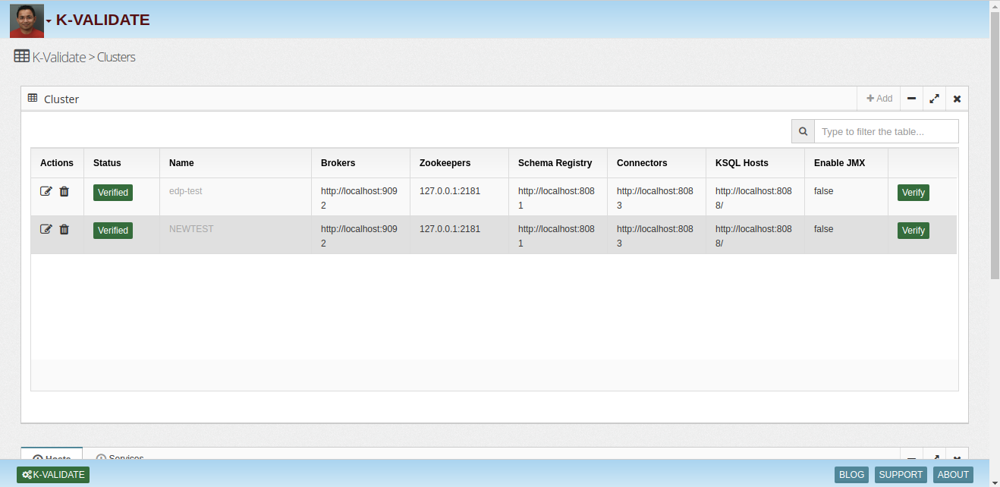
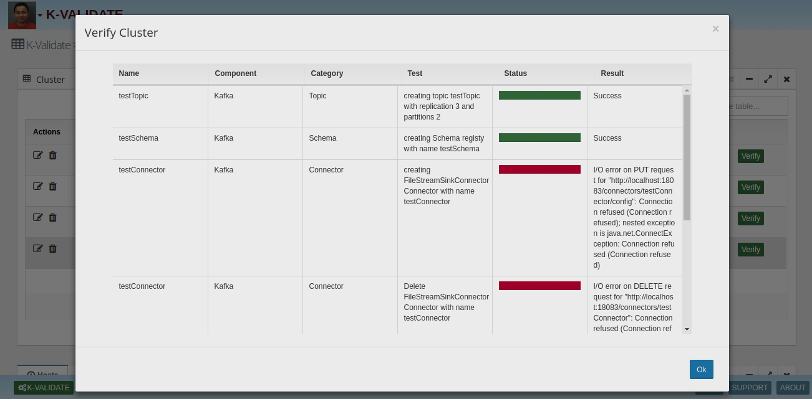

## Kafka-Validator

Kafka Validator is a Web UI and command line utility to validate a Kafka cluster. 

Test Cases
------
Kafka Validator uses the configuration to conduct set of test cases. Following are few examples:
* Topic - Connect, authenticate, create a topic, perform some operations and delete a topic
* Data - Produce JSON and AVRO packets and recieve the same
* Schema - Connect, authenticate, create a new schema and delete schema
* Connector - Connect, authenticate, create a simple File sink connector and validate the data
* ACLs - Create a topic, assign ACLs and validate the permissions
* REST Proxy - Connect, authenticate, send and recieve messages
* KSQL - Test creation of streams and tables
* Zookeeper - Validate Zookeeper quorum
* Control Center - Connect and authenticate

Web UI
------
Create a cluster

Cluster Verification

Command Line
------
bin/kvalidate config.properties

To learn more, check out [http://insightlake.com/kafkavalidator.html](http://insightlake.com/kafkavalidator.html)

Installation
------
* Download or clone the repository. 
* Run bin/insightlake command.
* Open browser with URL as http://localhost:8080/
* Change configuration in /conf folder to set different ports
* By default H2 database is used.
* If you want to change Database H2 to mysql, Configure mysql proeprty in jdbc.properties file.
* Configure new changes in insightlake script.

## Demo Link
https://insightlake.s3.amazonaws.com/releases/kafkavalidator/index.html

License - Free for commercial use
------
InsightLake Data Explorer is a commercial product but distributed to be used freely. Please contact contact@insightlake.com for details.

Getting Help
----------

You can get help easily :
Slack Channel - [Join InsightLake Slack Community](https://join.slack.com/t/insightlake/shared_invite/enQtNzQzMDE3MDI4ODA1LWM2YmI5MDUzODM5ZjQzZjE3ZDk1MjhiNThjMTBkODJjMGU2OWJmOWQ0MDE5NGI4YjYyYjVhZjEzYzY3YzIzMjY)

Twitter - https://twitter.com/InsightLake

Facebook - https://www.facebook.com/insightlake/

